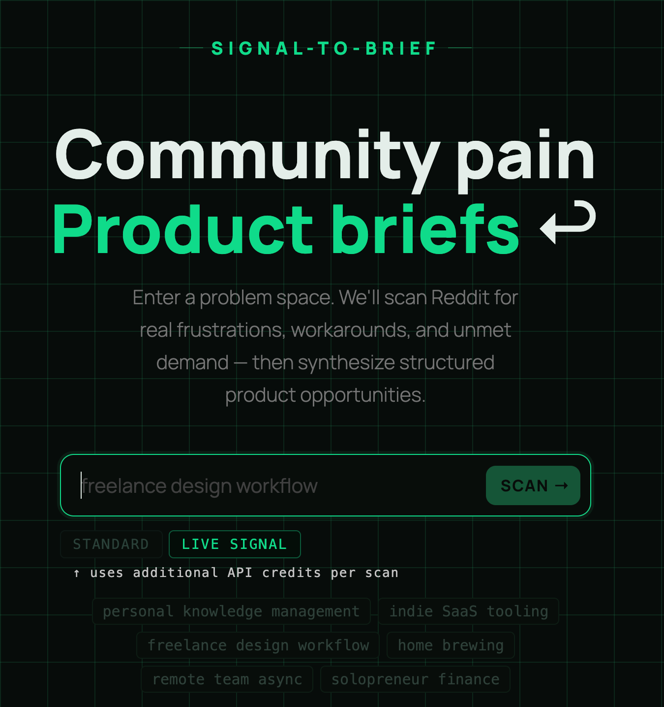
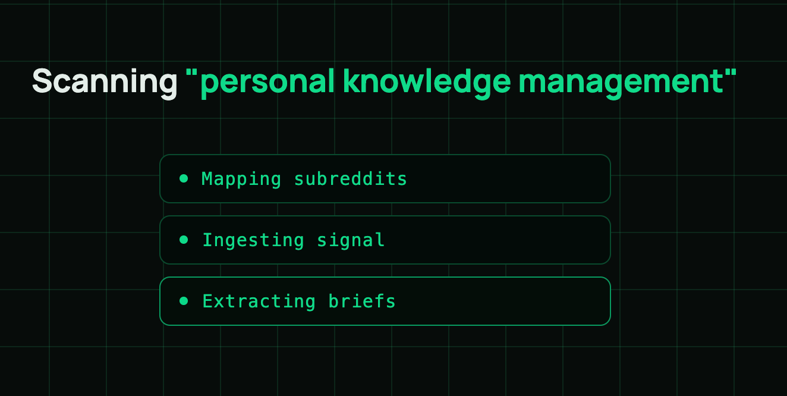
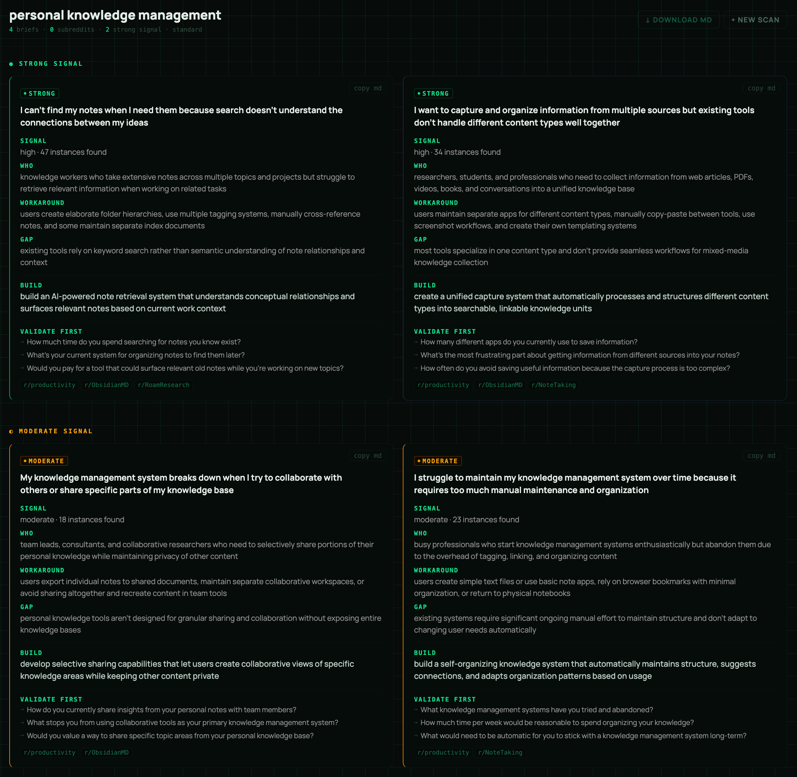

# SIGNAL-TO-BRIEF

**Community pain → structured product briefs**

Scans Reddit for real frustrations, pulls workarounds and unmet demand, and turns them into structured product briefs. The Claude Code skill path requires no API key setup beyond your existing Claude access. The web UI path requires an Anthropic API key.

<table>
  <tr>
    <td width="33%"><a href="assets/screenshot-home.png"></a></td>
    <td width="33%"><a href="assets/screenshot-scanning.png"></a></td>
    <td width="33%"><a href="assets/screenshot-briefs.png"></a></td>
  </tr>
</table>

---

## Why this exists

Most Reddit research tools stop at sentiment scores and ranked results. That's raw input, not a decision. The real signal is workarounds — when a community invents one, demand is proven and no solution owns the space. That's the premise this tool is built on.

---

## What it produces

Each brief contains:

| Field                  | What it tells you                                                                |
| ---------------------- | -------------------------------------------------------------------------------- |
| `problem_statement`    | The problem in plain user language, not product language                         |
| `target_user`          | Behavioral description — what they're doing, not who they are                    |
| `workaround_evidence`  | Exactly what people do instead. This is the validation signal.                   |
| `incumbent_gap`        | Why existing solutions fail this user specifically                               |
| `product_hypothesis`   | One-sentence build direction                                                     |
| `validation_questions` | What to verify before committing to build                                        |
| `signal_strength`      | `strong / moderate / weak` — scored by frequency + workaround + subreddit spread |

Briefs are sorted strong → moderate → weak.

---

## Two ways to run it

### Option A — Claude Code skill (recommended)

No API key setup required beyond your existing Claude Code access. Install the two free MCP servers that power the data layer:

```bash
# RivalSearchMCP — Reddit, HN, Product Hunt, Dev.to, Medium
claude mcp add --transport http RivalSearchMCP https://RivalSearchMCP.fastmcp.app/mcp

# Reddit MCP Buddy — deep subreddit access, hot posts, search, comments
claude mcp add --transport stdio reddit-mcp-buddy -s user -- npx -y reddit-mcp-buddy
```

Add the skill:

```bash
npx skills add https://github.com/jmsmrgn/signal-to-brief --skill signal-to-brief
```

Then run it:

```
Run signal-to-brief on the indie SaaS / bootstrapped founder tooling space
```

```
signal-to-brief: what are the biggest pain points in indie SaaS tooling
```

```
Use signal-to-brief to find product gaps in the freelance design workflow space
```

---

### Option A (Gemini CLI)

Gemini CLI is also supported. Add the MCP servers to `~/.gemini/settings.json`:

```json
{
  "mcpServers": {
    "reddit-mcp-buddy": {
      "command": "npx",
      "args": ["-y", "reddit-mcp-buddy"]
    },
    "RivalSearchMCP": {
      "url": "https://RivalSearchMCP.fastmcp.app/mcp"
    }
  }
}
```

Install the skill:

```bash
gemini skills install https://github.com/jmsmrgn/signal-to-brief
```

Then trigger with the same natural language prompts. Tool name mappings and Gemini-specific config live in [`GEMINI.md`](GEMINI.md).

---

### Option B — Hosted web UI (self-deployed)

Deploy your own private instance. Vercel prompts for your API key during setup — it's stored in Vercel's encrypted environment storage and used at build time.

[](https://vercel.com/new/clone?repository-url=https%3A%2F%2Fgithub.com%2Fjmsmrgn%2Fsignal-to-brief&env=VITE_ANTHROPIC_API_KEY&envDescription=Your%20Anthropic%20API%20key.%20Stored%20in%20Vercel%2C%20not%20entered%20in%20the%20browser.&envLink=https%3A%2F%2Fconsole.anthropic.com%2Fsettings%2Fkeys)

**Important:** This is a personal deployment. Vite embeds `VITE_*` environment variables into the compiled JS bundle at build time — this is standard practice for private tools, but means the key is readable in the page source. Keep the deployed URL private. Do not share it as a public app where others would use it with your key.

**For local dev and quick demos:** If `VITE_ANTHROPIC_API_KEY` is not set, the UI prompts for the key at runtime. The key lives in component state for the session only — it is never written to localStorage and never sent to any server other than Anthropic's API directly. It is, however, visible in the browser's network tab on every request, which is an inherent limitation of calling an API directly from a browser. Use this path when trying the tool locally or demoing it yourself, not when deploying for others to use with their own keys.

---

## Signal scoring rules

```
strong   = high frequency + workaround documented + signal across multiple subreddits
moderate = moderate frequency OR workaround documented OR single community signal
weak     = rare signal OR no workaround documented
```

Only act on strong or moderate. Weak briefs are hypotheses worth filing, not building.

---

## Example output

See [`/examples`](/examples) for real runs against:

- `indie-saas-tooling.md` — indie SaaS / bootstrapped founder tooling
- `pkm-tooling.md` — personal knowledge management

Generated unedited from a single run. Quality varies by how active the vertical's practitioner communities are.

---

## Repo structure

```
signal-to-brief/
├── SKILL.md                  # Claude Code skill — drop into your skills directory
├── signal-to-brief.jsx       # Standalone React UI
├── README.md
└── examples/
    ├── indie-saas-tooling.md
    └── pkm-tooling.md
```

---

## Stack

- Data: [reddit-mcp-buddy](https://github.com/karanb192/reddit-mcp-buddy) (Reddit signal) + [RivalSearchMCP](https://github.com/damionrashford/RivalSearchMCP) (HN, Product Hunt, Dev.to, Medium) — both free, zero auth
- Model: Claude Sonnet (via Anthropic API or Claude Code)
- UI: React, no dependencies beyond Anthropic API access

No paid data services required. No API keys beyond your existing Anthropic access.

---

## Limitations

- Works best in verticals where practitioners complain publicly — active subreddits where people describe real workflows, not communities that just discuss the topic from the outside.
- The UI runs in two modes: **standard** (Claude uses training knowledge — fast but not real-time) and **live** (Anthropic's web search tool — real-time, but web crawl rather than API access). The MCP skill (Claude Code / Gemini CLI) has the deepest access: structured Reddit API queries, sort/time filters, and comment-level data via reddit-mcp-buddy.
- The workaround evidence field will sometimes return "none documented" — this means validate before proceeding, not that no demand exists.
- Re-run against the same vertical every 4–6 weeks. Signal shifts.

---

## Running locally

**Prerequisites:** Node 18+, Anthropic API key with web search enabled

```bash
npm install
cp .env.example .env
# Add your key to .env: VITE_ANTHROPIC_API_KEY=sk-ant-...
npm run dev
```

Open [http://localhost:5173](http://localhost:5173). For local development, setting the key in `.env` is fine — the dev server is not public-facing. If `VITE_ANTHROPIC_API_KEY` is not set, the UI prompts for the key at runtime; the key lives in component state only and is never written to disk or localStorage.

---

## Deploy to Vercel

Use the deploy button in the [Option B section](#option-b--hosted-web-ui-self-deployed) above — it pre-fills the env var prompt during Vercel setup. Read the security note there before deploying.

**Manual deploy:**

```bash
vercel --prod
```

Set your API key in the Vercel dashboard under **Settings → Environment Variables → `VITE_ANTHROPIC_API_KEY`**. The key will be embedded in the compiled JS bundle — appropriate for a private personal deployment, not for a shared public URL.

> Note: web search capability (`web_search_20250305` tool) must be enabled on your API key for the live extraction stage to work. Check your Anthropic console under API settings.

---

## Contributing

Open issues for verticals that produce weak output, extraction prompt improvements, or UI changes. PRs welcome.

---

## License

MIT
